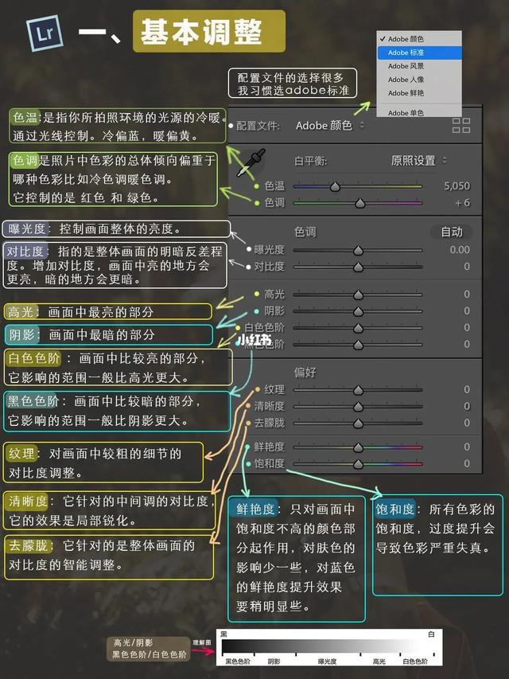
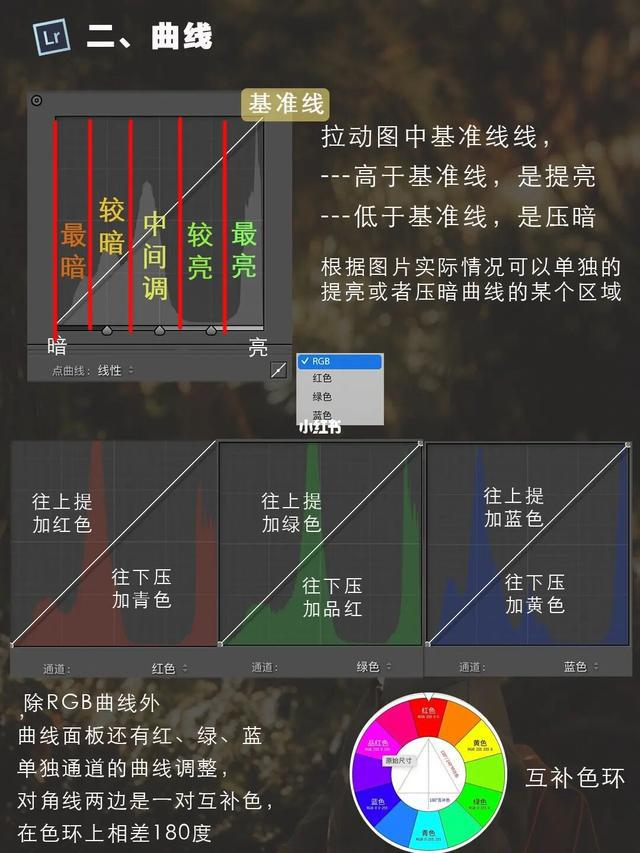
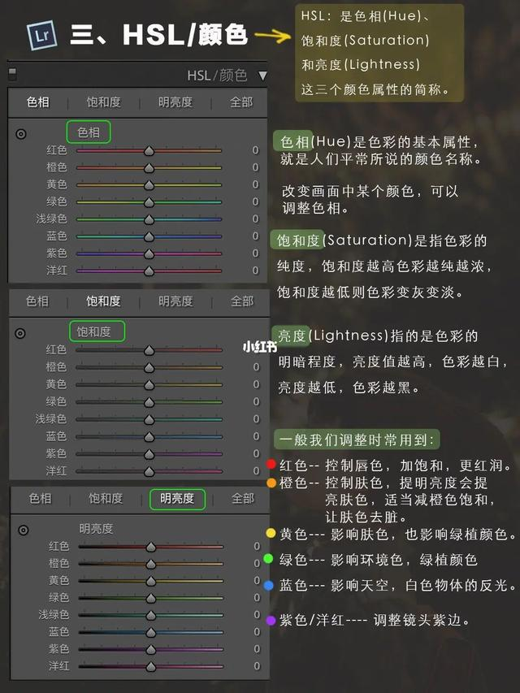
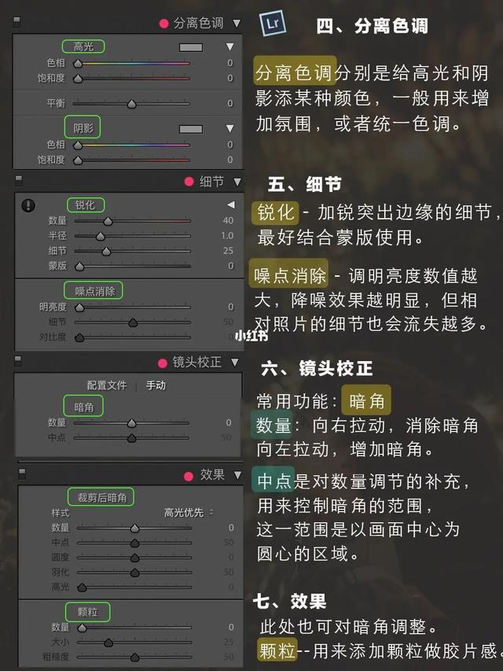
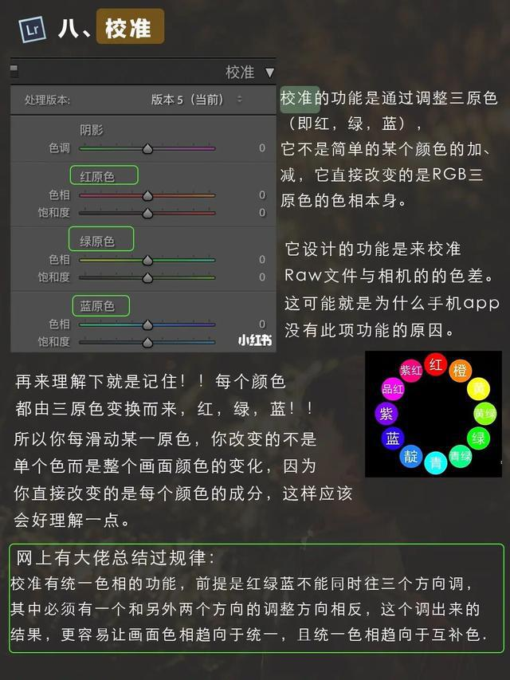
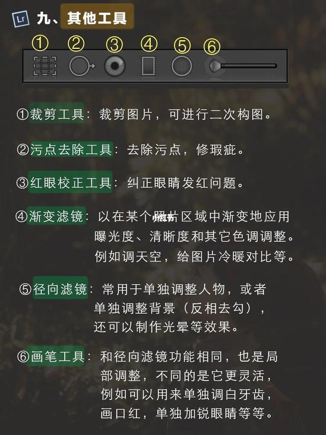

## 基本调整

色温：拍照环境的光源的冷暖。由光线控制。冷偏蓝，暖偏黄。

色调：它控制的是红色和绿色。

曝光度：控制画面整体亮度的平均分布。

对比度：整体画面的明暗反差程度。增加对比度，画面中亮的地方会更亮，暗的地方会更暗。

高光：画面中最亮的部分

阴影：画中最暗的部分

白色色阶：画面中比较亮的部分，它影响的范围一般比高光更大。

黑色色阶：画面中比较暗的部分，它影响的范围一般比阴影更大。

纹理：对画面中较粗的细节的对比度调整。

清晰度：针对的中间调的对比度，它的效果是局部锐化。

去朦胧：针对的是整体画面的对比度的智能调整。

鲜艳度：只对画面中饱和度不高的颜色部分起作用。

饱和度：所有色彩的饱和度，过度提升会导致色彩严重失真。

### HSL

色相( Hue )是色彩的基本属性，就是人们平常所说的颜色名称。

饱和度( Saturation )是指色彩的纯度，饱和度越高色彩越纯越浓，饱和度越低则色彩变灰变淡。

亮度( Lightness )指的是色彩的明暗程度，亮度值越高，色彩越白，亮度越低，色彩越黑。

调整时常用到小技巧：

> 红色：控制唇色，加饱和，更红润。
>
> 橙色：控制肤色，提明亮度会提亮肤色，适当减橙色饱和，让肤色去脏。
>
> 黄色：影响肤色，也影响绿植颜色。
>
> 绿色：影响环境色，绿植颜色
>
> 蓝色：影响天空，白色物体的反光。
>
> 紫色/洋红：调整镜头紫边

分离色调:分别是给高光和阴影添某种颜色，一般用来增加氛围，或者统一色调。

锐化-加锐突出边缘的细节，最好结合蒙版使用。

噪点消除-调明亮度数值越大，降噪效果越明显，但相对照片的细节也会流失越多。

镜头校正里的暗角可用于油画风类修图加暗角增加氛围感。

效果里面的颗粒--用来添加颗粒做胶片感。

其他功能

> 裁剪工具用来二次构图
>
> 污点去除工具修补瑕疵
>
> 局部调整工具：渐变滤镜，径向滤镜，画笔工具。

